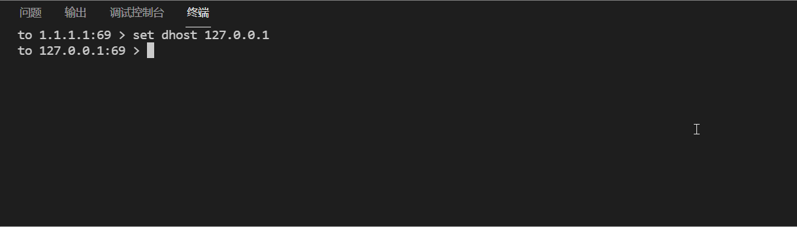
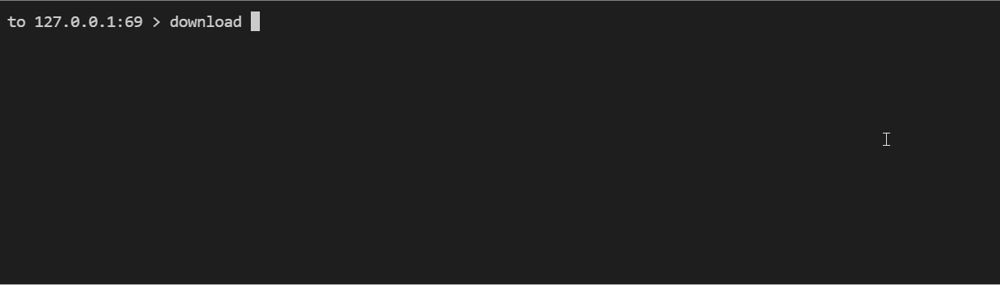

# udp--SimpleTFTP

## 计网实验一

&emsp;本次实验目标写出利用udp实现tftp客户端，可与服务器进行交互上下载文件，可显示吞吐量，另外自己完成对异常情况( 延时、掉包等等 -> 由clumsy检测 )的处理。

&emsp;其实实验本身功能十分简单也没什么很困难的地方，先用wireshark抓几个包观察一下很快就能完成基本功能。之后就是界面问题了(~~这么有限的两个功能谁TM画Qt啊~~)然后自己又很nc地想做出一个交互型的命令行，然后就引入了封装等等一系列问题，最后形成了现在这个垃圾代码。

## 基本功能

- help/h              查看命令
- set option param    设置属性值
- quit/q              退出
- upload filename     上载文件
- download filename   下载文件
- log                 查看日志
- options             查看当前属性值

## 正常情况下效果图

## 存在丢包等事件时

因为异常情况速率太低使用低kb大小级别文件

## 已实现功能

1. 正常上载下载
2. 显示吞吐量、下载速度
3. 显示当前进度、日志实现
4. 简单异常情况处理(时延、丢包)
5. 错误异常处理

## 待实现功能

1. Tab自动补全指令
2. 节流、篡改的异常情况